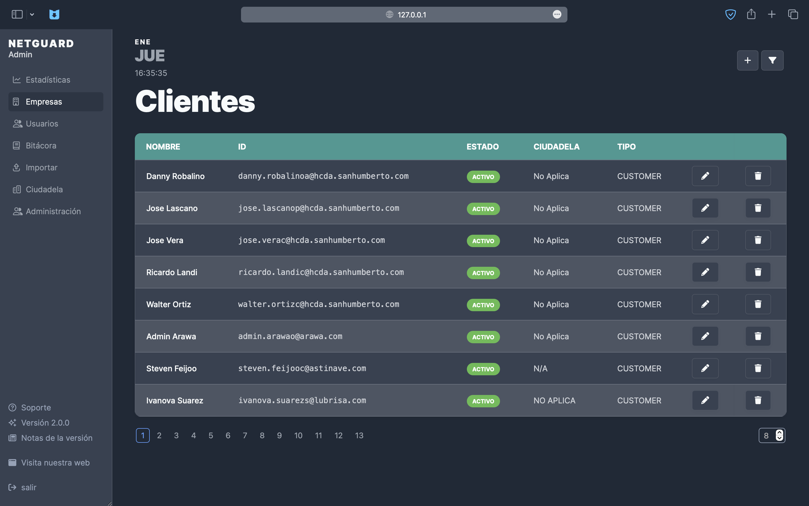
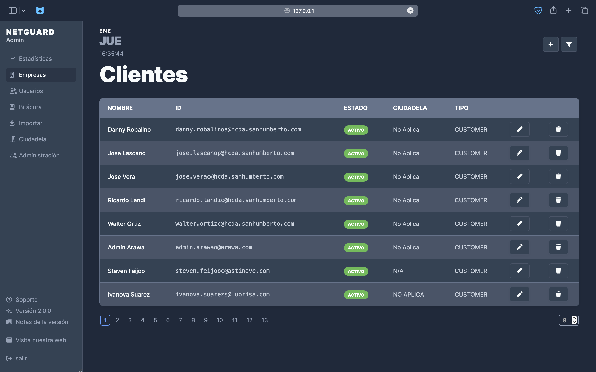
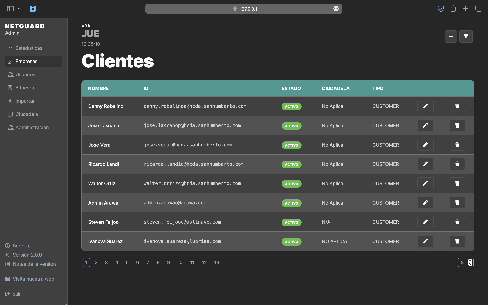

# Netguard platform

**Reporting bugs:**  
https://github.com/NETLIINKS-S-A/mainPlatform/issues

**Platform access:**  
https://netliinks-s-a.github.io/mainPlatform/

 

# ✨ New Themes

> The option to change themes will be added after finishing the platform preferences view

## Dark

`class="dark"`

## Dark Slategray

`class="dark_slategray"`

## Dark Neutral

`class="dark_neutral"`

